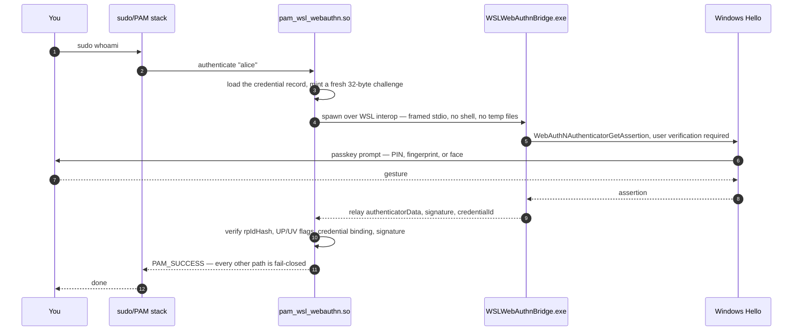

# wsl-webauthn-pam

[](https://github.com/kirin-xiao/wsl-webauthn-pam/actions/workflows/ci.yaml)
[](LICENSE)
[](#other-ways-to-install)
[](#requirements)

**Passwordless `sudo` and `su` inside WSL2, authenticated with the Windows
Hello passkey you already use — with every cryptographic decision made on the
Linux side.**

`wsl-webauthn-pam` is a Linux PAM module plus a tiny Windows helper. Run
`sudo`, a Windows passkey prompt appears; approve it with your PIN,
fingerprint, or face and you are done. Decline it, and `sudo` falls back to
your password exactly as before.

It is a pure PAM module — it does not fork or replace `sudo`, does not touch
`sudoers`, and works for anything that authenticates through PAM. It is an
independent rewrite of
[WSL-Hello-sudo](https://github.com/nullpo-head/WSL-Hello-sudo) built on the
real Windows WebAuthn / FIDO2 platform authenticator instead of the legacy
project's `KeyCredentialManager` signing oracle (see
[Prior art](#prior-art)).

> **Status.** 0.1.0 is the initial release. Windows Hello credentials from
> WSL-Hello-sudo are **not** migrated: the legacy key is never imported and
> every user re-enrolls from scratch. Bug reports and feedback are welcome.

## Highlights

- **A real WebAuthn ceremony, not a signing oracle.** Enrollment verifies the
  TPM attestation chain up to the pinned **Microsoft TPM Root CA 2014**; every
  `sudo` verifies a signature over a fresh, Linux-minted challenge.
- **All trust stays on Linux.** The Windows helper (`WSLWebAuthnBridge.exe`)
  relays bytes and decides nothing. Root-owned Linux code verifies every
  byte it receives: RP ID hash, user-presence and user-verification flags,
  credential binding, and the signature itself.
- **Fail-closed by construction.** Exactly one code path returns success. A
  missing config, interop failure, timeout, or unreadable credential store
  denies Hello and falls through to the next PAM method.
- **The bridge binary is pinned.** Its SHA-256 is recorded at enrollment and
  re-checked on every authentication — a replaced `.exe` is never launched,
  and there is no flag to disable the check.
- **No shells, no temp files, no OpenSSL.** The bridge is spawned with framed
  stdio over WSL interop; the verifier is pure Rust (`#![forbid(unsafe_code)]`)
  over a root-only, symlink-hardened credential store.
- **Observable.** `probe`, `status`, and `verify` answer "why didn't it work?"
  in seconds, and every decision is logged to the auth journal — no more
  debugging blind through `su`.

## Quick start

```sh
curl -fsSL https://github.com/kirin-xiao/wsl-webauthn-pam/releases/latest/download/bootstrap.sh | sudo bash
```

This downloads the latest release, verifies the tarball against the published
`SHA256SUMS` (the hard gate), best-effort verifies the signed
build-provenance attestation when the `gh` CLI is installed, then provisions
the module, bridge, config, and PAM profile, runs the Windows Hello enrollment
ceremony, and enables the profile — only after a verified credential. On
success it prints:

```text
Done. `sudo` now uses Windows Hello.
  If you decline the Hello prompt, sudo falls back to your password.
  Test it:  sudo -k; sudo true
  Add another user later:  sudo /usr/local/bin/wsl-webauthn-pam enroll
```

Two Windows dialogs appear during enrollment: first a *save your passkey*
confirmation, then your PIN or biometric. The dialog can open behind the
terminal — the CLI announces each prompt and the bridge flashes its taskbar
button. **Type your PIN into the Windows dialog, never the terminal.**

Pass options through to the installer, or pin a release:

```sh
curl -fsSL .../bootstrap.sh | sudo bash -s -- --allow-unattested
curl -fsSL .../bootstrap.sh | sudo bash -s -- --version v0.1.0
```

Prefer to read before you run? Security tooling should make that easy:

```sh
curl -fsSLO https://github.com/kirin-xiao/wsl-webauthn-pam/releases/latest/download/bootstrap.sh
gh attestation verify bootstrap.sh -R kirin-xiao/wsl-webauthn-pam   # optional
less bootstrap.sh
sudo bash bootstrap.sh
```

## Requirements

- **Windows 10 1903+** (build 18362) — anything that runs WSL2 today has
  `webauthn.dll`.
- **WSL2 with interop enabled** (WSL1 is untested). Note that systemd services
  may not see the interop session leader, so Hello can work from an
  interactive shell but not from a service.
- **Windows Hello set up** — PIN, fingerprint, or face. TPM-backed for the
  default enrollment policy.
- **A Linux distro with PAM.** The packaged profile uses `pam-auth-update`
  (Debian/Ubuntu family); on other distros the installer prints the exact
  manual `/etc/pam.d` instructions instead.
- **To build from source:** stable Rust (1.88+, edition 2024) and
  `libpam0g-dev` on Debian/Ubuntu.

## Other ways to install

### Two commands (pre-provision)

Provision first, enroll later — for fleet provisioning or enrolling each user
individually:

```sh
sudo wsl-webauthn-pam install --skip-enroll   # provision; profile left disabled
sudo wsl-webauthn-pam enroll                  # enroll; enables the profile on success
```

`install` also supports `--dry-run`, `--yes`/`-y`, and `--non-interactive` for
scripted provisioning, and `enroll --user <NAME>` for a user other than the
invoking one. The profile is deliberately enabled **only after a credential is
verified**; a skipped, declined, or failed enrollment leaves it disabled and
prints the exact recovery commands.

### From source

```sh
git clone https://github.com/kirin-xiao/wsl-webauthn-pam
cd wsl-webauthn-pam
make release                            # builds the Linux module + CLI and the Windows bridge
tar xzf build/wsl-webauthn-pam-<version>-<arch>.tar.gz -C build
sudo build/wsl-webauthn-pam-<version>-<arch>/wsl-webauthn-pam install
```

`install` copies the CLI to `/usr/local/bin/wsl-webauthn-pam`, so the short
command works from any directory afterwards. The bridge builds natively with
`cargo.exe` on Windows (what CI ships) or cross-compiles on Linux with
`rustup target add x86_64-pc-windows-gnu`.

<details>
<summary><strong>Manual installation (no installer)</strong></summary>

1. Copy `pam_wsl_webauthn.so` to the PAM security directory, e.g.
   `/usr/lib/x86_64-linux-gnu/security/` (Debian/Ubuntu) or
   `/usr/lib64/security/` (RHEL/Fedora).
2. Copy `WSLWebAuthnBridge.exe` anywhere onto the Windows side; the config
   pins its path.
3. Write `/etc/wsl_webauthn/config` as root, mode `0600`:

   ```toml
   bridge_path = "/mnt/c/Users/<you>/AppData/Local/Programs/wsl-webauthn-pam/WSLWebAuthnBridge.exe"
   win_mnt     = "/mnt/c"
   # timeout_secs = 60        # optional override
   ```

4. Create the credential store:
   `sudo install -d -m 0700 -o root -g root /etc/wsl_webauthn/credentials`
5. Enroll: `sudo wsl-webauthn-pam enroll --no-enable`
6. Add the module to the relevant service (e.g. `/etc/pam.d/sudo`):

   ```text
   auth sufficient pam_wsl_webauthn.so
   ```

   Or use the packaged `pam-config` profile with
   `pam-auth-update --enable wsl-webauthn`. The profile's
   `[success=end default=ignore]` control is the `pam-auth-update` idiom;
   `pam-auth-update` expands it to a computed jump (`end` is not a literal
   PAM action, so do not paste it raw into `/etc/pam.d`).

</details>

## How it works



Everything the bridge returns is treated as untrusted input. The bridge holds
no keys and makes no decisions — a malicious bridge can fail, stall, or
attempt consent phishing, but it cannot forge an accepted assertion.

**What you see.** On `sudo`, the module prints a one-line cue naming the
service and the Linux user being elevated (for example: *Windows Hello:
authenticating 'sudo' for Linux user alice — a Windows passkey prompt is
waiting; check the taskbar and do not type here*). The Windows dialog is
titled *Sign in with a passkey* and shows **Passkey for wsl-webauthn-pam** —
that is the pinned relying-party ID, not a configurable display name.

**Decline and cancel.** Cancelling the prompt is an ordinary failure: `sudo`
falls through to the password prompt (with a short delay), and everything
behaves as if the module were not installed.

**Enrollment.** `enroll` runs the matching make-credential ceremony with
`attestation = DIRECT`, verifies the attestation chain to the pinned
Microsoft TPM root, and only then writes a root-owned credential record. A
first-ever enrollment can come back unattested; under the default policy it
is discarded and retried once with a fresh challenge, and enrollment fails
unless a strictly verified credential is produced.

## Security

The short version:

- **Attested enrollment.** `tpm`/`packed` attestation must chain to the pinned
  **Microsoft TPM Root CA 2014** with a Windows Hello AAGUID. A software key
  is refused by default; `--allow-unattested` exists for TPM-less machines
  you control, is recorded in the credential record, and is never a silent
  fallback.
- **Pinned RP ID and origin.** Compile-time constants, asserted byte-for-byte
  on the Linux side, never carried on the wire.
- **Pinned bridge.** The `.exe` is hash-checked on every launch, using the
  same file descriptor it executes.
- **Hardened store.** One root-owned credential record per Linux user
  (`0700`/`0600`), symlink-refusing, swap-detecting, atomic-write, and
  bounded-read.
- **No surprises.** No telemetry, no accounts, and no network at
  authentication time. The only network use is the release download you run
  yourself.

The full threat model — attacker capabilities, the verified-invariant list,
and how each error path is fail-closed — lives in
[SECURITY.md](SECURITY.md). Honest limits, in short:

- A compromised Windows session already has Linux root via `wsl.exe -u root`
  — a root shell that bypasses PAM, `sudo`, and `su` entirely — so this module
  is not a boundary against it, and a passkey prompt an attacker can raise
  gains it nothing. Against an adversary that cannot reach WSL interop, it adds
  a passwordless path that does not lower the bar below the existing Linux
  password and cannot forge an assertion for an enrolled credential.
- The guarantee is scoped to a pinned RP ID, which is not a browser-grade
  origin guarantee for a native client.
- Not a roaming authenticator: machine loss or reset means re-enrollment.
  Windows exposes no API to delete non-resident credentials, so replaced
  Hello keys are orphaned but harmless.
- Compromised Linux root and TPM hardware attacks are out of scope by
  definition.

### Don't lock yourself out

The shipped profile uses a fail-through control: it inserts

```text
auth [success=end default=ignore]  pam_wsl_webauthn.so
```

so a Hello attempt that fails, times out, or never even gets a prompt
(module missing, credential gone, bridge broken) is **ignored** and PAM
falls through to the next method — normally your password. Under the
shipped configuration the module adds no new way to lose password access;
an account with no password or a hand-edited `required`/`requisite` line
(which the installer refuses to produce) is the exception.

Rely on the account's **local password** while you test. WSL has no virtual
console (`Ctrl-Alt-F2`), but from a Windows terminal a root shell for the
distro **bypasses PAM entirely** and does not depend on the Linux
configuration:

```powershell
wsl.exe -d <distro> -u root
```

```sh
pam-auth-update --remove wsl-webauthn   # or: edit /etc/pam.d/* by hand
```

## Using the CLI

`wsl-webauthn-pam <COMMAND> [OPTIONS]` (installed at
`/usr/local/bin/wsl-webauthn-pam`; `-h` prints the full usage). Operational
failures print stable tokens you can script against — `error[not-found]`,
`error[interop-unavailable]`, `error[bridge-integrity]`, … — and the exit
code is `0` on success, `1` on operational failure, `2` on usage error.

| Command | What it does | Root? | Key options |
|---|---|---|---|
| `install` | Provision the bridge, config, module, profile, and CLI | yes | `--skip-enroll`, `--dry-run`, `--yes`, `--non-interactive`, `--allow-unattested`, `--artifact-dir`, `--module-dir`, `--win-mnt` |
| `enroll` | Run the Windows Hello ceremony for one Linux user, then enable the profile | yes | `--replace`, `--allow-unattested`, `--no-enable`, `--user <NAME>` |
| `unregister` | Remove one user's credential record | yes | `--user <NAME>`, `--yes` |
| `uninstall` | Remove a credential or all components | yes | `--user <NAME>` or `--all` (also removes the CLI), `--yes`, `--non-interactive` |
| `probe` | Report interop and Hello availability, check the bridge pin | no | `--bridge`, `--win-mnt` |
| `status` | List enrolled users and the config summary | no (root for the records) | `--user <NAME>` for one full record |
| `verify` | Self-test the crypto stack against a synthetic ceremony | no | — |

A few real runs:

```console
$ wsl-webauthn-pam verify
verify: PASS
  attestation: packed / StrictVerified
  assertion:   verified (ES256)
  negative control: tampered signature rejected
  negative control: disallowed AAGUID rejected

$ sudo wsl-webauthn-pam probe
Bridge:  /mnt/c/Users/kim/AppData/Local/Programs/wsl-webauthn-pam/WSLWebAuthnBridge.exe
win_mnt: /mnt/c
interop: OK
api_version: 9
Windows Hello: available
pin:     OK (matches the enrolled bridge)
```

`verify` runs the production verifier against a synthetic attestation and
assertion — no Windows and no root needed — so `PASS` means the crypto core
works end to end, with both negative controls (a tampered signature and a
disallowed AAGUID) proven rejected along the way.

### PAM module arguments

| Argument | Effect |
|---|---|
| `quiet` | Never emit the terminal action cue |
| `debug` | Verbose logging (never secrets) |
| `timeout=<secs>` | Whole-ceremony deadline, clamped to `1..=600`; invalid values are logged and ignored |

```text
auth [success=end default=ignore] pam_wsl_webauthn.so quiet timeout=120
```

The same timeout can be set globally with `timeout_secs` in
`/etc/wsl_webauthn/config` (written by `install`; a plain TOML file you can
hand-edit).

## Troubleshooting

**`sudo` just asks for a password — the module never seems to trigger.**
Check `sudo wsl-webauthn-pam status` first (profile enabled? credential
present?), then the auth log: `journalctl -t pam_wsl_webauthn` or your
distro's `auth.log` (facility `authpriv`). The `debug` module argument adds
detail. The module writes nothing to stdout; its only terminal output is the
one-line cue, which requires a controlling terminal under `sudo`'s silent
mode and is suppressed entirely by `quiet`.

**`install` finished but `sudo` still asks for a password.**
Either the profile is not enabled or the invoking user has no credential —
both are visible in `status`. Enable with
`sudo pam-auth-update --enable wsl-webauthn` and enroll with
`sudo wsl-webauthn-pam enroll`. Install and enroll enable the profile
automatically **only after a verified credential**; a failed or declined
enrollment leaves it disabled on purpose.

**The Windows prompt appears behind other windows.**
The bridge parents the prompt to your current foreground window and
best-effort raises it (falling back to a taskbar flash), but WSL focus
handling can still lose. Watch the taskbar for the Windows Security icon.
Type the PIN into the **dialog**, never the terminal — the cue and the CLI
both tell you when a prompt is up.

**`interop-unavailable` — the bridge never starts.**
WSL interop needs the `WSLInterop` `binfmt_misc` registration enabled.
Systemd services often cannot reach the session leader, so Hello may work
from an interactive shell but not from a service. The runner fails fast
rather than hanging.

**The prompt times out.**
Default deadline is 60 s (55 s advisory in the dialog plus a hard Linux-side
deadline, with up to ~5 s of cleanup). Override with the `timeout=<secs>`
module argument or `timeout_secs` in the config, clamped to `1..=600`. A
watchdog expiry is reported as `timeout`; pressing *cancel* in the dialog is
`user_cancelled` and falls through to the password.

**`error[bridge-integrity]` — the bridge pin fails after I replaced the `.exe`.**
That is the pin doing its job: the digest recorded at enrollment no longer
matches. Re-enroll (`sudo wsl-webauthn-pam enroll --replace`) to trust the
new binary. The pin is always enforced; there is no module argument to
disable it. Note that upgrading in place changes the `.exe` bytes (it carries
version metadata), so upgrades re-enroll.

## FAQ

**Why WebAuthn instead of the old `KeyCredentialManager`?**
The legacy primitive was an RSA signing oracle with an unattested,
attacker-influenceable public key and a blind, fixed prompt — a person proved
"a gesture happened", nothing more. WebAuthn gives attestation to a pinned
TPM root, RP-scoping, a consent-bearing prompt, and assertions whose contents
are fully verified on the Linux side.

**Is my old WSL-Hello-sudo configuration migrated?**
No. Fresh enrollment is required and the legacy PEM is never imported. The
installer detects a legacy install and offers to rewrite stale `/etc/pam.d`
references (with confirmation and a backup) — it never carries the old key
over.

**Several Linux users share one Windows account — does that work?**
Yes, and that is the normal WSL case. Each Linux user enrolls once and has
exactly one credential record of their own, bound for audit to the Windows
account that enrolled it.

**I installed it in one distro; what about my other distros?**
Each distro is a separate Linux system with its own `/etc/pam.d`, so install
and enroll once per distro.

**Can I use this on a machine without a TPM?**
Only with `--allow-unattested`, and only on a machine you control. Without a
TPM there is no attestation, so the software key is accepted on trust and
the record says so.

**Does it modify `sudoers`?**
No. Everything goes through the PAM stack.

## Prior art

This project would not exist without
[WSL-Hello-sudo](https://github.com/nullpo-head/WSL-Hello-sudo), which proved
the reusable-Hello-gesture idea and was loved for it. `wsl-webauthn-pam` is an
independent rewrite, not a drop-in upgrade: the trust model, the protocol, the
installer, and the credential store are all new, and re-enrollment is required.
The legacy project's structural weaknesses — unauthenticated enrollment of an
attacker-influenceable public key, a blind consent dialog, and a shell-based
installer — are what the WebAuthn ceremony, Linux-side verification, and the
pinned-bridge design exist to fix.

## Development

```sh
cargo fmt --all -- --check
cargo clippy --workspace --all-targets --locked -- -D warnings
cargo test --workspace --locked
```

Build and PR gates, fuzzing, the cross-compiled Windows bridge, and the
repository layout are covered in [CONTRIBUTING.md](CONTRIBUTING.md). Security
issues: [SECURITY.md](SECURITY.md).

## License

MIT — see [LICENSE](LICENSE).
